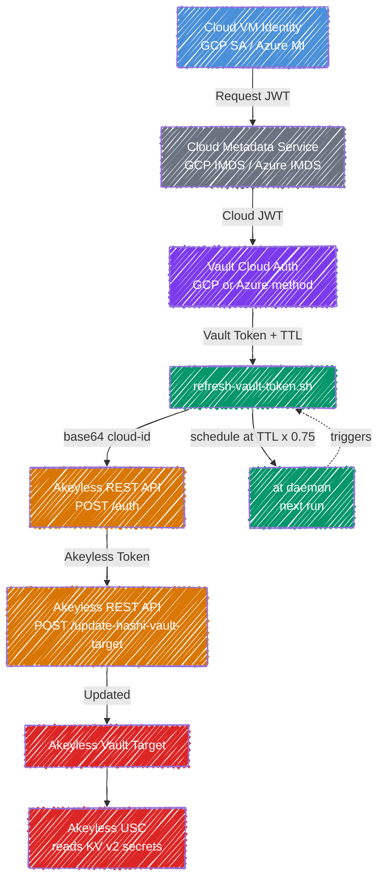

# Vault Token Refresh for Akeyless USC

Automated HashiCorp Vault token rotation using cloud identity (GCP or Azure) for the Akeyless Universal Secrets Connector (USC).

## Problem

Akeyless USC requires a valid Vault token to read secrets. Vault tokens expire based on a configurable TTL. This script automates the rotation cycle so the USC never loses access.

## The Approach

- The VM's cloud identity (GCP service account or Azure managed identity) is a stable, non-expiring credential managed by the cloud provider
- Each rotation cycle authenticates to Vault independently via the cloud auth method, producing a completely new token that is not a child of any previous token
- There is no "old token to revoke", expired tokens simply age out based on TTL
- No static Vault credentials are ever stored or managed

Vault Enterprise offers a built-in root token rotation API, but this is not available in the open-source edition and only applies to the root token, not to policy-scoped tokens used by integrations like USC.

### Why API-Only (No CLI Dependency)

The script uses `curl` against the Akeyless REST API rather than requiring the `akeyless` CLI to be installed. This keeps the dependency footprint minimal (`curl`, `jq`, `at`) and makes the script portable across environments where installing additional tooling may not be permitted or practical.

### Why TTL-Aware Scheduling (Not Fixed Cron)

Different customers configure different token TTLs. A fixed 30-minute cron works for a 1-hour TTL but wastes cycles on a 24-hour TTL and fails entirely for a 15-minute TTL. The script reads the actual TTL from Vault's login response and schedules the next run at 75% of that value. If an admin changes the Vault role's TTL, the schedule adapts on the next rotation, no reconfiguration needed.

## How It Works



1. Gets a cloud identity token from the VM's metadata service (GCP or Azure)
2. Presents the JWT to Vault's cloud auth method to get a Vault token
3. Optionally verifies the token can read secrets
4. Authenticates to Akeyless via REST API using cloud identity or UID token
5. Updates the Akeyless Vault Target with the new Vault token via REST API
6. Reads the token's TTL from Vault's response and schedules its own next run at 75% of TTL using `at`

**No static credentials stored.** Cloud identity is the stable, non-expiring credential. Vault tokens are ephemeral and independent, no parent-child token chains.

## Akeyless Auth: Cloud Identity vs UID Token

By default the script authenticates to Akeyless using the VM's cloud identity (`AKEYLESS_ACCESS_TYPE=gcp` or `azure_ad`). This is the simplest option, no secret to manage, but the Akeyless permissions are tied to the VM's identity. If you run multiple rotator instances on the same VM for different targets, they all share the same permission set.

For least-privilege isolation, set `AKEYLESS_ACCESS_TYPE=universal_identity`. Each rotator instance gets its own UID auth method in Akeyless, scoped to only the target it manages. The script reads the UID token from a file, authenticates, and saves the rotated token back for the next run.

### Setup

```bash
# 1. Create a UID auth method
akeyless create-auth-method-universal-identity \
  --name "/vault-refresh/uid-auth" --ttl 60

# 2. Create a role scoped to the specific target
akeyless create-role --name "/vault-refresh/vault-target-updater"
akeyless set-role-rule \
  --role-name "/vault-refresh/vault-target-updater" \
  --path "/Path/to/vault-target" \
  --capability update --rule-type target-rule

# 3. Associate the auth method with the role
akeyless assoc-role-am \
  --role-name "/vault-refresh/vault-target-updater" \
  --am-name "/vault-refresh/uid-auth"

# 4. Generate the initial UID token
akeyless uid-generate-token \
  --auth-method-name "/vault-refresh/uid-auth"
# Save the token value to the token file
echo -n "u-AQAAAD..." > ~/.vault-refresh-uid-token
chmod 600 ~/.vault-refresh-uid-token
```

### Config

```bash
AKEYLESS_ACCESS_TYPE=universal_identity
AKEYLESS_ACCESS_ID=p-xxxxxxxxxxxx   # from step 1
UID_TOKEN_FILE=~/.vault-refresh-uid-token
```

### When to use which

| | Cloud Identity | UID Token |
|---|---|---|
| **Permissions scoped to** | The VM | The auth method |
| **Secrets to manage** | None | UID token file |
| **Best for** | Single-target VMs | Multi-target VMs, least-privilege |
| **Scales with** | Infrastructure | Access policies |

## TTL-Aware Scheduling

The script adapts to whatever TTL the Vault role is configured with:

| Vault Token TTL | Next Run Scheduled At | Ratio |
|-----------------|----------------------|-------|
| 30 minutes      | 22 minutes           | 0.75  |
| 1 hour          | 45 minutes           | 0.75  |
| 4 hours         | 3 hours              | 0.75  |
| 24 hours        | 18 hours             | 0.75  |

The ratio is configurable via `REFRESH_RATIO`.

## Prerequisites

- VM with cloud identity enabled:
  - **GCP**: Service account attached to the instance
  - **Azure**: System-assigned managed identity enabled
- HashiCorp Vault with the appropriate cloud auth method configured
- A Vault role bound to the VM's identity with the required policies
- An Akeyless auth method (GCP or Azure AD type) with permission to update the target
- `at` daemon (`atd`) running
- `curl`, `jq`

## Quick Start

```bash
# 1. Copy the script
sudo cp refresh-vault-token.sh /usr/local/bin/
sudo chmod +x /usr/local/bin/refresh-vault-token.sh

# 2. Ensure atd is running
sudo systemctl enable --now atd

# 3. Create config from the example
cp .env.example ~/.vault-refresh.env
chmod 600 ~/.vault-refresh.env
# Edit ~/.vault-refresh.env with your values

# 4. Run (self-schedules the next run automatically)
/usr/local/bin/refresh-vault-token.sh
```

## Configuration

All configuration is via a `.env` file at `~/.vault-refresh.env` (or set `ENV_FILE` to override the path). See `.env.example` for the template. The `.env` file should be `chmod 600`, it contains your Akeyless access ID.

| Variable | Required | Default | Description |
|----------|----------|---------|-------------|
| `VAULT_ADDR` | Yes | - | Vault API address (e.g. `http://127.0.0.1:8200`) |
| `VAULT_ROLE` | Yes | - | Vault cloud auth role name |
| `CLOUD_PROVIDER` | Yes | - | `gcp` or `azure` |
| `AKEYLESS_API` | Yes | - | Akeyless API URL (e.g. `https://api.akeyless.io`) |
| `AKEYLESS_ACCESS_ID` | Yes | - | Akeyless auth method access ID |
| `AKEYLESS_ACCESS_TYPE` | Yes | - | Akeyless auth type (`gcp`, `azure_ad`, or `universal_identity`) |
| `AKEYLESS_TARGET_NAME` | Yes | - | Akeyless Vault Target path |
| `VAULT_URL` | Yes | - | External Vault URL for the Akeyless target |
| `REFRESH_RATIO` | No | `0.75` | Fraction of TTL to wait before next refresh |
| `VERIFY_PATH` | No | - | KV v2 path to verify (e.g. `secret/data/app/db`) |
| `SELF_SCHEDULE` | No | `true` | Set to `false` to disable `at`-based self-scheduling |
| `LOG_FILE` | No | `/var/log/refresh-vault-token.log` | Log file path |
| `ENV_FILE` | No | `~/.vault-refresh.env` | Path to the config file |
| `UID_TOKEN_FILE` | No | `~/.vault-refresh-uid-token` | UID token file (only for `universal_identity`) |

## Akeyless REST API (No CLI Required)

The script uses two Akeyless API endpoints directly via `curl`, so no `akeyless` CLI installation is needed.

**Authentication**, `POST /auth`
```json
{
  "access-id": "p-xxxx",
  "access-type": "gcp",
  "cloud-id": "<base64-encoded cloud identity JWT>"
}
```

**Target Update**, `POST /update-hashi-vault-target`
```json
{
  "token": "<akeyless-token>",
  "name": "/Path/to/target",
  "vault-token": "<new-vault-token>",
  "hashi-url": "https://vault.example.com"
}
```

> **Important:** The `cloud-id` field requires the cloud JWT to be **base64-encoded** before sending. The raw JWT will fail with a decode error.

## Vault Setup

### GCP

```bash
# Enable GCP auth
vault auth enable gcp

# Configure with service account credentials
vault write auth/gcp/config credentials=@sa-key.json

# Create role bound to VM's service account
vault write auth/gcp/role/usc-token-role \
  type="gce" \
  policies="usc-access" \
  bound_projects="my-project" \
  bound_service_accounts="my-sa@my-project.iam.gserviceaccount.com" \
  token_ttl="1h" \
  token_max_ttl="4h"
```

### Azure

Azure requires a **verifier service principal**, a separate app registration that Vault uses to validate tokens presented by clients. This is distinct from the VM's managed identity.

```bash
# Enable Azure auth
vault auth enable azure

# Configure with verifier service principal
vault write auth/azure/config \
  tenant_id="<TENANT_ID>" \
  resource="https://management.azure.com/" \
  client_id="<VERIFIER_APP_ID>" \
  client_secret="<VERIFIER_SECRET>"
```

> **Important:** The Azure role **must** include `bound_service_principal_ids` (the VM's managed identity object ID). Using only `bound_subscription_ids` and `bound_resource_groups` is not sufficient, Vault will reject the login with "expected specific bound_group_ids or bound_service_principal_ids".

```bash
# Get the VM's managed identity object ID (run on the VM)
OID=$(curl -s -H Metadata:true \
  'http://169.254.169.254/metadata/identity/oauth2/token?api-version=2018-02-01&resource=https%3A%2F%2Fmanagement.azure.com%2F' \
  | python3 -c "import sys,json,base64; t=json.load(sys.stdin)['access_token'].split('.')[1]; print(json.loads(base64.urlsafe_b64decode(t+'=='))['oid'])")

# Create role with the identity bound
vault write auth/azure/role/usc-token-role \
  bound_subscription_ids="<SUB_ID>" \
  bound_resource_groups="<RG_NAME>" \
  bound_service_principal_ids="$OID" \
  token_policies="usc-access" \
  token_ttl="1h" \
  token_max_ttl="4h"
```

### Vault Policy

The policy must include `sys/mounts` read access, the Akeyless USC needs this to detect whether the secrets engine is KV v1 or v2. Without it, the USC can list secrets but fails on read with a mount detection error.

```bash
vault policy write usc-access - <<'EOF'
path "secret/data/*" {
  capabilities = ["create", "read", "update", "delete", "list"]
}
path "secret/metadata/*" {
  capabilities = ["read", "list", "delete"]
}
path "secret/delete/*"   { capabilities = ["update"] }
path "secret/undelete/*" { capabilities = ["update"] }
path "secret/destroy/*"  { capabilities = ["update"] }
path "sys/mounts"        { capabilities = ["read"] }
path "sys/mounts/*"      { capabilities = ["read"] }
path "auth/token/lookup-self" { capabilities = ["read"] }
EOF
```

## Running Without Self-Scheduling

If you prefer external scheduling (e.g., an existing cron or orchestrator), disable self-scheduling:

```bash
SELF_SCHEDULE=false /usr/local/bin/refresh-vault-token.sh
```

The script will still log the recommended next-run interval based on TTL, so you can set your external schedule accordingly.

## Monitoring

```bash
# Check logs
tail -f /var/log/refresh-vault-token.log

# Check pending scheduled runs
atq

# Check current token TTL
curl -s "$VAULT_ADDR/v1/auth/token/lookup-self" \
  -H "X-Vault-Token: <token>" | jq '.data | {ttl, expire_time}'
```

## Troubleshooting

| Symptom | Cause | Fix |
|---------|-------|-----|
| `Failed to get GCP identity token` | Service account not attached | Check VM service account in GCP console |
| `Failed to get Azure JWT` | Managed identity not enabled | `az vm identity assign --name $VM --resource-group $RG` |
| `Vault auth failed` | Role binding mismatch | Check `bound_service_accounts` (GCP) or `bound_service_principal_ids` (Azure) |
| `Akeyless auth failed: illegal base64` | Raw JWT sent instead of base64-encoded | This is handled by the script; if calling the API manually, base64-encode the JWT first |
| `Akeyless auth failed` | Wrong access-id or type | Verify `AKEYLESS_ACCESS_ID` and `AKEYLESS_ACCESS_TYPE` in `.env` |
| `Token verify failed` | Policy missing permissions | Update Vault policy, ensure `sys/mounts` read is included |
| `USC list works but get fails` | Missing `sys/mounts` in policy | USC needs `sys/mounts` to detect KV v2 engine version |
| `at: command not found` | `at` not installed | `sudo apt-get install at && sudo systemctl enable --now atd` |

## License

MIT
