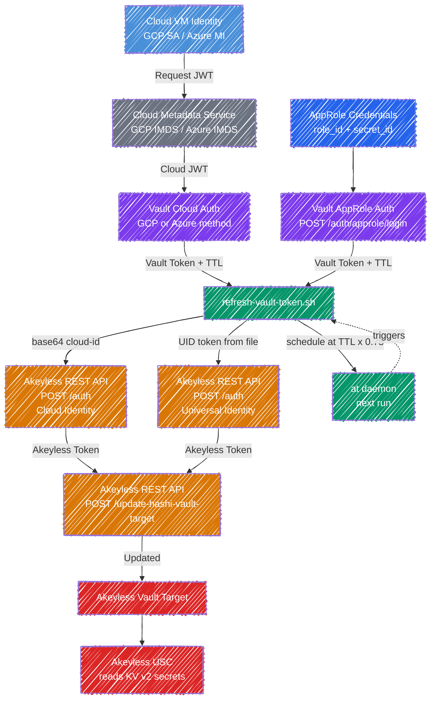

# Vault Token Refresh for Akeyless USC

Automated HashiCorp Vault token rotation for the Akeyless Universal Secrets Connector (USC). Supports GCP cloud identity, Azure managed identity, and Vault AppRole authentication.

## Problem

Akeyless USC requires a valid Vault token to read secrets. Vault tokens expire based on a configurable TTL. This script automates the rotation cycle so the USC never loses access.

## The Approach

- Each rotation cycle authenticates to Vault independently, producing a completely new token that is not a child of any previous token
- There is no "old token to revoke"; expired tokens simply age out based on TTL
- Three Vault auth methods are supported: GCP cloud identity, Azure managed identity, and AppRole
- Cloud identity methods use the VM's non-expiring credential managed by the cloud provider
- AppRole allows rotation from any environment (bare metal, containers, non-cloud VMs) without requiring cloud metadata services

Vault Enterprise offers a built-in root token rotation API, but this is not available in the open-source edition and only applies to the root token, not to policy-scoped tokens used by integrations like USC.

### Why API-Only (No CLI Dependency)

The script uses `curl` against the Akeyless REST API rather than requiring the `akeyless` CLI to be installed. This keeps the dependency footprint minimal (`curl`, `jq`, `at`) and makes the script portable across environments where installing additional tooling may not be permitted or practical.

### Why TTL-Aware Scheduling (Not Fixed Cron)

Different customers configure different token TTLs. A fixed 30-minute cron works for a 1-hour TTL but wastes cycles on a 24-hour TTL and fails entirely for a 15-minute TTL. The script reads the actual TTL from Vault's login response and schedules the next run at 75% of that value. If an admin changes the Vault role's TTL, the schedule adapts on the next rotation, no reconfiguration needed.

## How It Works



### Cloud Identity Flow (GCP / Azure)

1. Gets a cloud identity token from the VM's metadata service
2. Presents the JWT to Vault's cloud auth method to get a Vault token
3. Optionally verifies the token can read secrets
4. Authenticates to Akeyless via REST API using cloud identity or UID token
5. Updates the Akeyless Vault Target with the new Vault token via REST API
6. Reads the token's TTL from Vault's response and schedules its own next run at 75% of TTL using `at`

**No static credentials stored.** Cloud identity is the stable, non-expiring credential. Vault tokens are ephemeral and independent, no parent-child token chains.

### AppRole Flow

1. Reads `role_id` from config and `secret_id` from a file on disk
2. Authenticates to Vault via `POST /v1/auth/approle/login`
3. Optionally verifies the token can read secrets
4. Authenticates to Akeyless via UID token (cloud identity is not available in AppRole mode)
5. Updates the Akeyless Vault Target with the new Vault token via REST API
6. Reads the token's TTL and schedules the next run

AppRole requires `AKEYLESS_ACCESS_TYPE=universal_identity` since there is no cloud metadata service to provide a cloud identity JWT for the Akeyless auth step. The script will exit with an error if you set AppRole for Vault auth but use a cloud identity type for Akeyless auth.

## Vault Auth Methods

### GCP Cloud Identity

Uses the VM's service account to authenticate. The GCP metadata service provides a JWT that Vault validates.

- No secrets to store or rotate on the Vault side
- Requires the VM to have a service account attached
- Only works on GCP Compute Engine instances

### Azure Managed Identity

Uses the VM's system-assigned managed identity. The Azure IMDS provides a JWT that Vault validates.

- No secrets to store or rotate on the Vault side
- Requires system-assigned managed identity enabled on the VM
- Azure role must include `bound_service_principal_ids` (see [Vault Setup: Azure](#azure))

### AppRole

Uses a `role_id` (like a username) and `secret_id` (like a password) to authenticate to Vault. Works anywhere, not just cloud VMs.

- `role_id` is stored in the `.env` config file
- `secret_id` is stored in a separate file with `chmod 600`
- Can scope each AppRole to specific Vault policies for least-privilege
- Works on bare metal, containers, non-cloud VMs, and cloud VMs alike
- The AppRole mount path is configurable via `VAULT_APPROLE_MOUNT` (defaults to `approle`)

## Akeyless Auth: Cloud Identity vs UID Token

By default the script authenticates to Akeyless using the VM's cloud identity (`AKEYLESS_ACCESS_TYPE=gcp` or `azure_ad`). This is the simplest option, no secret to manage, but the Akeyless permissions are tied to the VM's identity. If you run multiple rotator instances on the same VM for different targets, they all share the same permission set.

For least-privilege isolation, set `AKEYLESS_ACCESS_TYPE=universal_identity`. Each rotator instance gets its own UID auth method in Akeyless, scoped to only the target it manages. The script reads the UID token from a file, authenticates, and saves the rotated token back for the next run.

**When using AppRole for Vault auth, you must use `universal_identity` for Akeyless auth.** There is no cloud metadata service available to provide the cloud identity JWT that Akeyless cloud auth requires.

### UID Auth Setup

```bash
# 1. Create a UID auth method
akeyless create-auth-method-universal-identity \
  --name "/vault-refresh/uid-auth" --ttl 60

# 2. Create a role scoped to the specific target
akeyless create-role --name "/vault-refresh/vault-target-updater"
akeyless set-role-rule \
  --role-name "/vault-refresh/vault-target-updater" \
  --path "/Path/to/vault-target" \
  --capability read \
  --capability update \
  --rule-type target-rule

# 3. Associate the auth method with the role
akeyless assoc-role-am \
  --role-name "/vault-refresh/vault-target-updater" \
  --am-name "/vault-refresh/uid-auth"

# 4. Generate the initial UID token
akeyless uid-generate-token \
  --auth-method-name "/vault-refresh/uid-auth"
# Save the token value to the token file
echo -n "u-AQAAAD..." > ~/.vault-refresh-uid-token
chmod 600 ~/.vault-refresh-uid-token
```

> **Important:** The role must have both `read` and `update` capabilities on the target. The `read` capability alone is not sufficient for `POST /update-hashi-vault-target`. The API returns HTTP 403 if `update` is missing.

### UID Auth Config

```bash
AKEYLESS_ACCESS_TYPE=universal_identity
AKEYLESS_ACCESS_ID=p-xxxxxxxxxxxx   # from step 1
UID_TOKEN_FILE=~/.vault-refresh-uid-token
```

### When to Use Which

| | Cloud Identity | UID Token |
|---|---|---|
| **Permissions scoped to** | The VM | The auth method |
| **Secrets to manage** | None | UID token file |
| **Best for** | Single-target VMs | Multi-target VMs, least-privilege |
| **Scales with** | Infrastructure | Access policies |
| **Required for AppRole** | No | Yes |

## TTL-Aware Scheduling

The script adapts to whatever TTL the Vault role is configured with:

| Vault Token TTL | Next Run Scheduled At | Ratio |
|-----------------|----------------------|-------|
| 30 minutes      | 22 minutes           | 0.75  |
| 1 hour          | 45 minutes           | 0.75  |
| 4 hours         | 3 hours              | 0.75  |
| 24 hours        | 18 hours             | 0.75  |

The ratio is configurable via `REFRESH_RATIO`.

## Prerequisites

- One of the following for Vault authentication:
  - **GCP**: VM with service account attached to the instance
  - **Azure**: VM with system-assigned managed identity enabled
  - **AppRole**: A Vault AppRole role with `role_id` and `secret_id` generated
- HashiCorp Vault with the corresponding auth method enabled and configured
- A Vault role (cloud) or AppRole role bound to the appropriate identity/credentials
- An Akeyless auth method with permission to update the target:
  - Cloud identity (`gcp` or `azure_ad` type) for cloud-based Vault auth, OR
  - Universal Identity (UID) auth method for AppRole-based Vault auth (required)
- `at` daemon (`atd`) running (for self-scheduling)
- `curl`, `jq`

## Quick Start

### Cloud Identity (GCP or Azure)

```bash
# 1. Copy the script
sudo cp refresh-vault-token.sh /usr/local/bin/
sudo chmod +x /usr/local/bin/refresh-vault-token.sh

# 2. Ensure atd is running
sudo systemctl enable --now atd

# 3. Create config from the example
cp .env.example ~/.vault-refresh.env
chmod 600 ~/.vault-refresh.env
# Edit with your values:
#   VAULT_AUTH_METHOD=azure  (or gcp)
#   VAULT_ROLE=usc-token-role
#   AKEYLESS_ACCESS_TYPE=azure_ad  (or gcp)

# 4. Run (self-schedules the next run automatically)
/usr/local/bin/refresh-vault-token.sh
```

### AppRole

```bash
# 1. Copy the script
sudo cp refresh-vault-token.sh /usr/local/bin/
sudo chmod +x /usr/local/bin/refresh-vault-token.sh

# 2. Ensure atd is running
sudo systemctl enable --now atd

# 3. Enable AppRole in Vault and create a role
vault auth enable approle
vault write auth/approle/role/usc-token-role \
  token_policies=usc-access \
  token_ttl=1h \
  token_max_ttl=4h \
  secret_id_ttl=24h

# 4. Get the role_id and generate a secret_id
vault read auth/approle/role/usc-token-role/role-id
vault write -f auth/approle/role/usc-token-role/secret-id

# 5. Store the secret_id
echo -n "<secret_id_value>" > ~/.vault-approle-secret-id
chmod 600 ~/.vault-approle-secret-id

# 6. Set up Akeyless UID auth (see "UID Auth Setup" above)
# Generate UID token and save it
echo -n "<uid_token_value>" > ~/.vault-refresh-uid-token
chmod 600 ~/.vault-refresh-uid-token

# 7. Create config
cp .env.example ~/.vault-refresh.env
chmod 600 ~/.vault-refresh.env
# Edit with your values:
#   VAULT_AUTH_METHOD=approle
#   VAULT_APPROLE_ROLE_ID=<role_id>
#   VAULT_APPROLE_SECRET_ID_FILE=~/.vault-approle-secret-id
#   AKEYLESS_ACCESS_TYPE=universal_identity
#   AKEYLESS_ACCESS_ID=<uid_auth_access_id>
#   UID_TOKEN_FILE=~/.vault-refresh-uid-token

# 8. Run
/usr/local/bin/refresh-vault-token.sh
```

## Configuration

All configuration is via a `.env` file at `~/.vault-refresh.env` (or set `ENV_FILE` to override the path). See `.env.example` for the template. The `.env` file should be `chmod 600`, it contains your Akeyless access ID and AppRole role ID.

### General

| Variable | Required | Default | Description |
|----------|----------|---------|-------------|
| `VAULT_ADDR` | Yes | - | Vault API address (e.g. `http://127.0.0.1:8200`) |
| `VAULT_AUTH_METHOD` | Yes | Falls back to `CLOUD_PROVIDER` | Vault auth method: `gcp`, `azure`, or `approle` |
| `AKEYLESS_API` | Yes | - | Akeyless API URL (e.g. `https://api.akeyless.io`) |
| `AKEYLESS_ACCESS_ID` | Yes | - | Akeyless auth method access ID |
| `AKEYLESS_ACCESS_TYPE` | Yes | - | Akeyless auth type: `gcp`, `azure_ad`, or `universal_identity` |
| `AKEYLESS_TARGET_NAME` | Yes | - | Akeyless Vault Target path |
| `VAULT_URL` | Yes | - | External Vault URL for the Akeyless target |
| `REFRESH_RATIO` | No | `0.75` | Fraction of TTL to wait before next refresh |
| `VERIFY_PATH` | No | - | KV v2 path to verify (e.g. `secret/data/app/db`) |
| `SELF_SCHEDULE` | No | `true` | Set to `false` to disable `at`-based self-scheduling |
| `LOG_FILE` | No | `/var/log/refresh-vault-token.log` | Log file path |
| `ENV_FILE` | No | `~/.vault-refresh.env` | Path to the config file |

### Cloud Auth (GCP / Azure)

| Variable | Required | Default | Description |
|----------|----------|---------|-------------|
| `VAULT_ROLE` | Yes (cloud) | - | Vault cloud auth role name |
| `CLOUD_PROVIDER` | No | - | Backward-compat alias for `VAULT_AUTH_METHOD` (`gcp` or `azure`) |

### AppRole Auth

| Variable | Required | Default | Description |
|----------|----------|---------|-------------|
| `VAULT_APPROLE_ROLE_ID` | Yes (approle) | - | AppRole role ID (UUID) |
| `VAULT_APPROLE_SECRET_ID_FILE` | No | `~/.vault-approle-secret-id` | Path to file containing the AppRole secret ID |
| `VAULT_APPROLE_MOUNT` | No | `approle` | Vault auth mount path for AppRole |

### UID Auth (Universal Identity)

| Variable | Required | Default | Description |
|----------|----------|---------|-------------|
| `UID_TOKEN_FILE` | No | `~/.vault-refresh-uid-token` | UID token file path. Required when `AKEYLESS_ACCESS_TYPE=universal_identity` |

## Backward Compatibility

If you have an existing `.env` with `CLOUD_PROVIDER=gcp` or `CLOUD_PROVIDER=azure`, the script continues to work without changes. `VAULT_AUTH_METHOD` takes precedence if set; otherwise it falls back to `CLOUD_PROVIDER`. The `VAULT_ROLE` variable is only required for cloud auth methods, not for AppRole.

## Akeyless REST API (No CLI Required)

The script uses two Akeyless API endpoints directly via `curl`, so no `akeyless` CLI installation is needed.

**Authentication**, `POST /auth`

Cloud identity:
```json
{
  "access-id": "p-xxxx",
  "access-type": "gcp",
  "cloud-id": "<base64-encoded cloud identity JWT>"
}
```

Universal identity:
```json
{
  "access-id": "p-xxxx",
  "access-type": "universal_identity",
  "uid_token": "<uid-token-from-file>"
}
```

**Target Update**, `POST /update-hashi-vault-target`
```json
{
  "token": "<akeyless-token>",
  "name": "/Path/to/target",
  "vault-token": "<new-vault-token>",
  "hashi-url": "https://vault.example.com"
}
```

> **Important:** The `cloud-id` field requires the cloud JWT to be **base64-encoded** before sending. The raw JWT will fail with a decode error.

## Vault Setup

### GCP

```bash
# Enable GCP auth
vault auth enable gcp

# Configure with service account credentials
vault write auth/gcp/config credentials=@sa-key.json

# Create role bound to VM's service account
vault write auth/gcp/role/usc-token-role \
  type="gce" \
  policies="usc-access" \
  bound_projects="my-project" \
  bound_service_accounts="my-sa@my-project.iam.gserviceaccount.com" \
  token_ttl="1h" \
  token_max_ttl="4h"
```

### Azure

Azure requires a **verifier service principal**, a separate app registration that Vault uses to validate tokens presented by clients. This is distinct from the VM's managed identity.

```bash
# Enable Azure auth
vault auth enable azure

# Configure with verifier service principal
vault write auth/azure/config \
  tenant_id="<TENANT_ID>" \
  resource="https://management.azure.com/" \
  client_id="<VERIFIER_APP_ID>" \
  client_secret="<VERIFIER_SECRET>"
```

> **Important:** The Azure role **must** include `bound_service_principal_ids` (the VM's managed identity object ID). Using only `bound_subscription_ids` and `bound_resource_groups` is not sufficient. Vault will reject the login with "expected specific bound_group_ids or bound_service_principal_ids".

```bash
# Get the VM's managed identity object ID (run on the VM)
OID=$(curl -s -H Metadata:true \
  'http://169.254.169.254/metadata/identity/oauth2/token?api-version=2018-02-01&resource=https%3A%2F%2Fmanagement.azure.com%2F' \
  | python3 -c "import sys,json,base64; t=json.load(sys.stdin)['access_token'].split('.')[1]; print(json.loads(base64.urlsafe_b64decode(t+'=='))['oid'])")

# Create role with the identity bound
vault write auth/azure/role/usc-token-role \
  bound_subscription_ids="<SUB_ID>" \
  bound_resource_groups="<RG_NAME>" \
  bound_service_principal_ids="$OID" \
  token_policies="usc-access" \
  token_ttl="1h" \
  token_max_ttl="4h"
```

### AppRole

```bash
# Enable AppRole auth
vault auth enable approle

# Create a policy for the rotator (same usc-access policy used by cloud auth)
vault policy write usc-access - <<'EOF'
path "secret/data/*" {
  capabilities = ["create", "read", "update", "delete", "list"]
}
path "secret/metadata/*" {
  capabilities = ["read", "list", "delete"]
}
path "secret/delete/*"   { capabilities = ["update"] }
path "secret/undelete/*" { capabilities = ["update"] }
path "secret/destroy/*"  { capabilities = ["update"] }
path "sys/mounts"        { capabilities = ["read"] }
path "sys/mounts/*"      { capabilities = ["read"] }
path "auth/token/lookup-self" { capabilities = ["read"] }
EOF

# Create the AppRole role
vault write auth/approle/role/usc-token-role \
  token_policies=usc-access \
  token_ttl=1h \
  token_max_ttl=4h \
  secret_id_ttl=24h \
  secret_id_num_uses=0

# Get the role_id (store in .env as VAULT_APPROLE_ROLE_ID)
vault read auth/approle/role/usc-token-role/role-id

# Generate a secret_id (store in the secret_id file)
vault write -f auth/approle/role/usc-token-role/secret-id
```

To use a custom mount path (e.g. `vault auth enable -path=custom-approle approle`), set `VAULT_APPROLE_MOUNT=custom-approle` in your `.env`.

### Vault Policy

The policy must include `sys/mounts` read access. The Akeyless USC needs this to detect whether the secrets engine is KV v1 or v2. Without it, the USC can list secrets but fails on read with a mount detection error.

```bash
vault policy write usc-access - <<'EOF'
path "secret/data/*" {
  capabilities = ["create", "read", "update", "delete", "list"]
}
path "secret/metadata/*" {
  capabilities = ["read", "list", "delete"]
}
path "secret/delete/*"   { capabilities = ["update"] }
path "secret/undelete/*" { capabilities = ["update"] }
path "secret/destroy/*"  { capabilities = ["update"] }
path "sys/mounts"        { capabilities = ["read"] }
path "sys/mounts/*"      { capabilities = ["read"] }
path "auth/token/lookup-self" { capabilities = ["read"] }
EOF
```

## Security Considerations: Cloud Identity vs UID Tokens

When using cloud identity to authenticate to Akeyless, the permissions of the rotator are tied to the infrastructure managing the rotation. If a single VM runs rotation for multiple targets, you must grant it broad target permissions.

With UID tokens, each rotator gets its own Akeyless auth method with a role scoped to only the target it manages. This provides per-rotator least-privilege and limits blast radius. The rotator handles its own UID token rotation as part of the auth cycle.

For AppRole, the same principle applies on the Vault side: each AppRole role can have its own narrow Vault policy. Combined with per-rotator UID tokens for Akeyless, this gives least-privilege on both sides of the chain.

| Deployment | Vault Auth | Akeyless Auth | Blast Radius |
|---|---|---|---|
| Single cloud VM, one target | Cloud identity | Cloud identity | VM-scoped |
| Single cloud VM, multiple targets | Cloud identity | UID per rotator | Per-target on Akeyless side |
| Any host, per-target isolation | AppRole per rotator | UID per rotator | Per-target on both sides |

## Running Without Self-Scheduling

If you prefer external scheduling (e.g., an existing cron or orchestrator), disable self-scheduling:

```bash
SELF_SCHEDULE=false /usr/local/bin/refresh-vault-token.sh
```

The script will still log the recommended next-run interval based on TTL, so you can set your external schedule accordingly.

## Monitoring

```bash
# Check logs
tail -f /var/log/refresh-vault-token.log

# Check pending scheduled runs
atq

# Check current token TTL
curl -s "$VAULT_ADDR/v1/auth/token/lookup-self" \
  -H "X-Vault-Token: <token>" | jq '.data | {ttl, expire_time}'
```

## Troubleshooting

| Symptom | Cause | Fix |
|---------|-------|-----|
| `Failed to get GCP identity token` | Service account not attached to the VM | Check VM service account in GCP console |
| `Failed to get Azure JWT` | Managed identity not enabled on the VM | `az vm identity assign --name $VM --resource-group $RG` |
| `Vault auth failed` (cloud) | Role binding mismatch | Check `bound_service_accounts` (GCP) or `bound_service_principal_ids` (Azure) |
| `Vault auth failed` (AppRole) | Wrong `role_id` or `secret_id`, or secret_id expired | Regenerate with `vault write -f auth/approle/role/<role>/secret-id` and update the file |
| `AppRole secret_id file not found` | `VAULT_APPROLE_SECRET_ID_FILE` points to a missing file | Create the file with the secret_id value and `chmod 600` |
| `AppRole secret_id file is empty` | File exists but has no content | Write the secret_id to the file: `echo -n "<secret_id>" > <file>` |
| `VAULT_APPROLE_ROLE_ID required` | Config missing the role_id | Add `VAULT_APPROLE_ROLE_ID=<uuid>` to your `.env` file |
| `Unsupported VAULT_AUTH_METHOD` | Typo or invalid value in config | Must be exactly `gcp`, `azure`, or `approle` |
| `AppRole does not provide cloud identity for Akeyless` | Using `VAULT_AUTH_METHOD=approle` with `AKEYLESS_ACCESS_TYPE=gcp` or `azure_ad` | AppRole has no cloud metadata. Set `AKEYLESS_ACCESS_TYPE=universal_identity` and configure a UID token |
| `UID token file not found` | UID token was never generated or file path is wrong | Generate with `akeyless uid-generate-token --auth-method-name <name>` and save to the configured `UID_TOKEN_FILE` path |
| `UID token file is empty` | File exists but the token was not written | Regenerate and write: `echo -n "<token>" > <file> && chmod 600 <file>` |
| `Akeyless UID auth failed` | UID token expired or auth method has no role association | Check that the UID auth method has a role associated via `akeyless assoc-role-am` |
| `Akeyless auth failed: illegal base64` | Raw JWT sent instead of base64-encoded | This is handled by the script; if calling the API manually, base64-encode the JWT first |
| `Akeyless auth failed` | Wrong `AKEYLESS_ACCESS_ID` or `AKEYLESS_ACCESS_TYPE` | Verify both values in `.env` match the auth method in Akeyless |
| Exit code 22 on target update | HTTP 403 from Akeyless, role lacks `update` on target | Add `update` capability: `akeyless set-role-rule --role-name <role> --path <target> --capability read --capability update --rule-type target-rule` |
| Target update silent failure (curl -sf) | Target name mismatch or target does not exist | Verify `AKEYLESS_TARGET_NAME` matches the exact path in Akeyless (case-sensitive, leading slash) |
| `Token verify failed` | Vault policy missing permissions on the verify path | Update Vault policy, ensure the `VERIFY_PATH` secret is readable and `sys/mounts` read is included |
| `USC list works but get fails` | Missing `sys/mounts` in Vault policy | USC needs `sys/mounts` to detect KV v2 engine version |
| `at: command not found` | `at` not installed | `sudo apt-get install at && sudo systemctl enable --now atd` |
| Script runs but Vault is unreachable | Vault is in Kubernetes and script runs on the host | Use the Vault ClusterIP service address (e.g. `http://10.x.x.x:8200`) as `VAULT_ADDR`, not `localhost` |
| `connection refused` on `localhost:8200` | Vault runs in a pod, not as a host service | Find the service IP with `kubectl get svc -n vault` and use that as `VAULT_ADDR` |

## License

MIT
